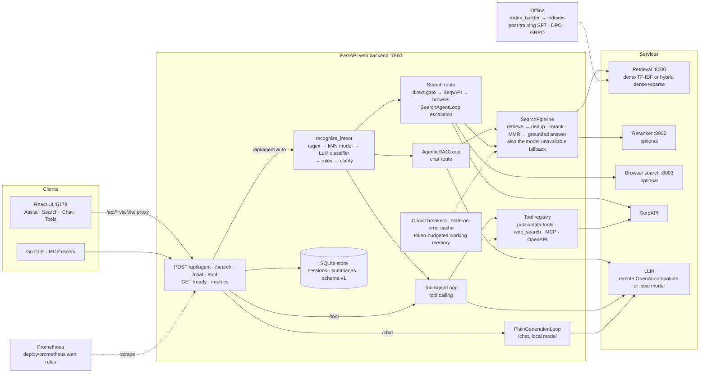
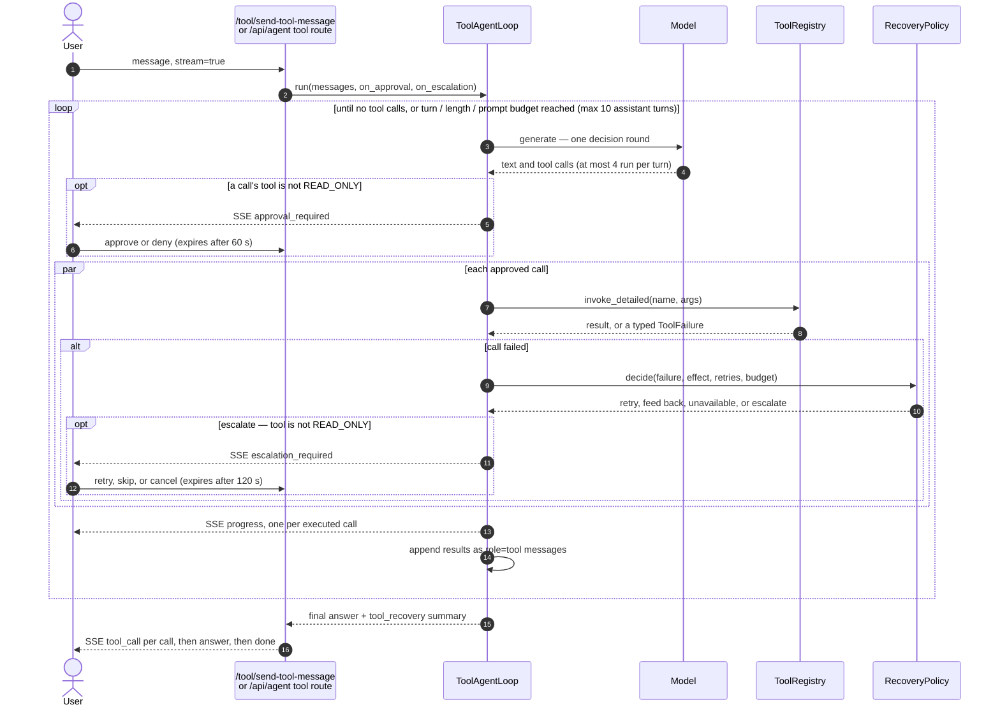
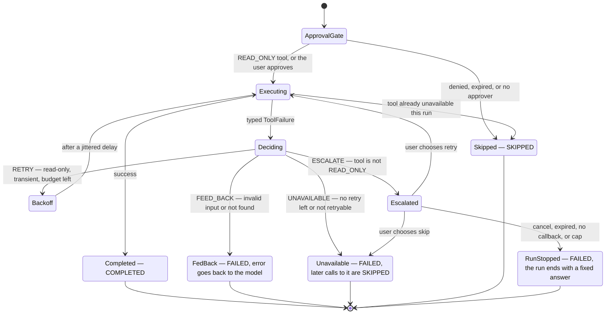

# Agentic Search

Agentic Search is a retrieval-backed platform for building multi-turn search, RAG, and tool-using agents. It combines a FastAPI backend, interchangeable retrieval services, a React development UI, and training and evaluation workflows in one repository.

## What it provides

- Agentic RAG with multi-turn search, query enhancement, citations, and grounded synthesis
- Conversation and tool-using agents with routing, memory, and structured tool dispatch
- Dense, sparse, and hybrid retrieval with fusion, reranking, and optimization workflows
- Connector data models, document ingestion, and offline index building via the `index_builder` CLI
- Web search through Google Custom Search, SerpAPI, and browser automation
- Search domains — sixteen topic domains plus a `general` default, selectable from the HTTP API or the Assist page, that hint a query toward a subject and route it to the capability that answers it: web search, or one of the keyless public data tools
- A React UI with four surfaces — an auto-routing Assistant plus direct Search, Chat, and Tool pages — with streaming responses, a running conversation transcript, source inspection, and observability panels
- Post-training for search agents — supervised (SFT), preference (DPO), and reinforcement (GRPO) — plus evaluation workflows
- Identity-aware access: signing in narrows results to what you may read and unlocks user-scoped tools and memory, without changing which engine runs
- MCP in both directions — a server exposing search and retrieval to compatible clients, and a client that turns another server's tools into ordinary registry tools

---

## Architecture

The web backend routes each `/api/agent` request to a chat, search, or tool agent; the direct Search, Chat, and Tools pages call their engines without routing. Retrieval, reranking, and browser search run as separate services, and every dependency the agents call is behind a degradation path. See [Architecture](docs/architecture.md) for the repository layout and request flows.



### Tool-calling sequence

How `ToolAgentLoop` runs one request, on the Tools page or the `/api/agent` tool route. Approval and escalation reach the user as SSE events; see [Tool engine](docs/tool-engine.md).



### Tool-call states

What happens to a single tool call. Each end state is the `TaskStatus` recorded for it; the retry, feed-back, unavailable, and escalate branches are `RecoveryPolicy`'s decision.



## Prerequisites

- Python 3.10+
- Node.js and npm
- An LLM provider API key for agent loops
- Java only when using BM25/pyserini

## Install

From the repository root:

```bash
pip install -e .
pip install -r requirements.txt
```

Install the optional MCP dependencies when needed:

```bash
pip install -e ".[mcp]"
```

Install frontend dependencies:

```bash
cd web && npm install
```

## Configure

Copy the example environment file, then provide the model settings required by your LLM provider:

```bash
cp .env.example .env
```

```dotenv
GEN_AI_MODEL_PROVIDER=openai
GEN_AI_MODEL_VERSION=gpt-4o-mini
GEN_AI_API_KEY=...
```

Provider, web-search, retrieval, reranking, routing, and application settings are documented in [Configuration](docs/configuration.md).

## Run locally

Start each service in a separate terminal from the repository root.

### 1. Start retrieval

The bundled demo corpus is served on port **8001**:

```bash
python3 -m src.internal.servers.retrieval.demo --corpus_path data/corpus.jsonl
```

```bash
# Named corpora / union via the registry (data/corpora.json):
python3 -m src.internal.servers.retrieval.demo --corpus demo   # curated 30-doc demo (default)
python3 -m src.internal.servers.retrieval.demo --corpus all    # union of all registered corpora
```

```bash
# Add a BEIR benchmark corpus. The converter registers what it writes, so the
# dataset is loadable by name straight afterwards (pip install beir first):
python3 -m examples.beir_to_corpus --dataset nfcorpus
python3 -m src.internal.servers.retrieval.demo --corpus nfcorpus
```

```bash
# Optional — cross-encoder reranker (Terminal 1b). Then set the env on the web
# backend and restart it so retrieved docs are reranked before display:
python3 -m src.internal.servers.retrieval.rerank --port 8002
# web backend env: AGENTIC_SEARCH_RERANK_URL=http://localhost:8002/rerank
```

### 2. Start the API

The FastAPI backend runs on port **7860**:

```bash
PYTHONPATH=src:. uvicorn src.internal.servers.web.app:app --host 127.0.0.1 --port 7860
```

### 3. Start the frontend

The live Vite development UI runs on port **5173** and proxies backend requests to port 7860:

```bash
cd web && npm run dev
```

Open <http://127.0.0.1:5173>. The header links to the four pages: **Assistant** (`/assist`), **Search** (`/search`), **Chat** (`/chat`), and **Tools** (`/tools`). Each has its own URL, so pages can be linked to and survive a refresh.

## Verify the stack

Check retrieval against the bundled corpus:

```bash
curl -s -X POST http://127.0.0.1:8001/retrieve \
  -H 'Content-Type: application/json' \
  -d '{"query": "what is FAISS?", "topk": 5}' | python3 -m json.tool
```

Check the API health endpoint:

```bash
curl -s http://127.0.0.1:7860/health | python3 -m json.tool
```

## Search engine

The search agent classifies each request, tries internal retrieval first, and falls through to web search when evidence is weak. It also exposes a dedicated retrieval-only surface at `POST /search/send-search-message` (the **Search** page, `/search`). See [Search engine](docs/search-engine.md) for capabilities and request routing.

A request may name a **search domain** — `finance`, `academic`, `legal`, `health`, and so on — on `POST /api/agent` or from the Assist page; `GET /api/search-domains` lists all seventeen. Sixteen carry a topic hint, which is appended to the query; `general` is the default and adds nothing. The hint steers the query; it is not a result filter. A non-`general` domain is only honoured by the `search_tool` and `hybrid_search` modes, or by auto when `mode` is omitted; any other mode rejects it with a 400 rather than ignoring it silently. The same taxonomy also routes the agent's own `search_domain` tool to a capability — web search, or one of the keyless public data tools for the six that return structured records — but that is the tool path, not this one.

## Chat engine

The chat agent answers conversational requests with retrieval-grounded synthesis and multi-turn memory. A direct `POST /chat/send-chat-message` endpoint (the **Chat** page, `/chat`) calls the local model with no retrieval, streaming a multi-turn transcript. See [Chat engine](docs/chat-engine.md) for capabilities and routing.

---

## Tool engine

The tool agent runs multi-turn function calling with structured tool dispatch over a registry of built-in and OpenAPI-backed tools. A dedicated `POST /tool/send-tool-message` surface (the **Tools** page, `/tools`) streams tool calls, gates tools with approval prompts, and fetches the web via a serpapi→browser cascade. See [Tool engine](docs/tool-engine.md) for capabilities, routing, and the tool registry.

### Built-in public data tools

The tool agent ships nine keyless public data-source tools, seeded by
`src/internal/tools/public_data/`. They need no API keys or configuration:

| Tool | Source |
| --- | --- |
| `search_wikipedia` | Wikipedia action API |
| `search_arxiv` | ArXiv export API |
| `search_wayback` | Internet Archive CDX API |
| `get_weather` | Open-Meteo |
| `get_stock_quote` | Yahoo Finance chart API |
| `get_crypto_price` | CoinGecko |
| `convert_currency` | exchangerate-api.com |
| `search_location` | Nominatim (OpenStreetMap) |
| `search_nearby_places` | Overpass (OpenStreetMap) |

The first three are citeable: they answer with `{title, content, url}` records,
so their results appear as source cards on `/tools`. The rest answer with a
JSON object of facts. Any upstream failure returns `{"error": ...}` from that
one tool and leaves the turn intact.

## Ingestion

The offline `index_builder` turns a corpus into the searchable sparse/dense indexes that queries read at request time — chunking, embedding, and writing the index artifacts. Chunking offers three strategies, one at a time: a default paragraph-and-section splitter, plus opt-in **recursive** (structure-aware — keeps code blocks and tables intact and splits prose down a Markdown heading hierarchy) and **semantic** (embedding-similarity) modes. Recursive and semantic are mutually exclusive. See [Ingestion](docs/ingestion.md) for the pipeline and connector data models, and [Retrieval](docs/retrieval.md#chunking) for chunking details.

## Common development commands

```bash
pytest                              # backend unit and regression tests
cd web && npm run typecheck         # frontend TypeScript check
cd web && npm run test              # frontend typecheck and unit tests
cd web && npm run build             # production bundle served by FastAPI
```

See [Testing](docs/testing.md) for focused suites and integration-test prerequisites.

---

## Documentation

- [Architecture](docs/architecture.md) — repository layout, agent families, routing, and request flows
- [Search engine](docs/search-engine.md) — search-agent capabilities and request-routing overview
- [Chat engine](docs/chat-engine.md) — chat-agent capabilities and routing overview
- [API request routing](docs/request-routing.md) — modes, intent classification, provider order, fallbacks, and response metadata
- [Tool engine](docs/tool-engine.md) — tool-agent capabilities, routing, and the tool registry
- [Retrieval](docs/retrieval.md) — retrieval services, indexing, reranking, tuning, and query transformation
- [Ingestion](docs/ingestion.md) — connector data models and the offline `index_builder` indexing tool
- [HTTP API reference](docs/api-reference.md) — local retrieval, web, chat/session, and health endpoints
- [Training and evaluation](docs/training-and-evaluation.md) — examples, datasets, SFT, DPO, GRPO, and benchmarks
- [Frontend development](docs/frontend.md) — React/Vite workflow, UI behavior, and observability surfaces
- [Command-line tools](docs/cli.md) — the Go `query` + `memory` CLIs, build, usage, auth, and exit codes
- [MCP server](docs/mcp.md) — installation, transport, client configuration, tools, and resources
- [Configuration](docs/configuration.md) — environment variables for providers, services, retrieval, and routing
- [Workload identity](docs/workload-identity.md) — automated-client authentication, production safeguards, and renewable Redis IAM credentials
- [Testing](docs/testing.md) — backend and frontend checks, integration tests, and debugging commands
- [Self-review task reports](docs/development/self-review-reports.md) — validated implementation handoffs and mandatory review gates
